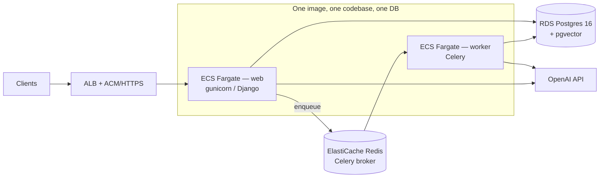
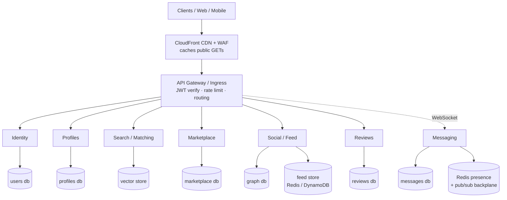
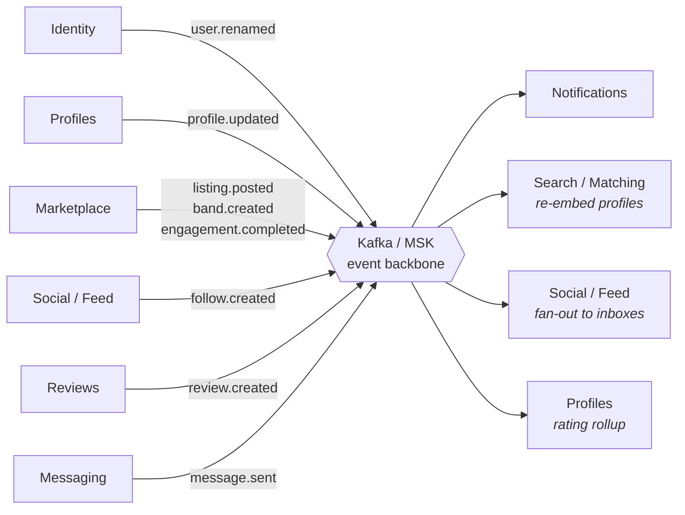
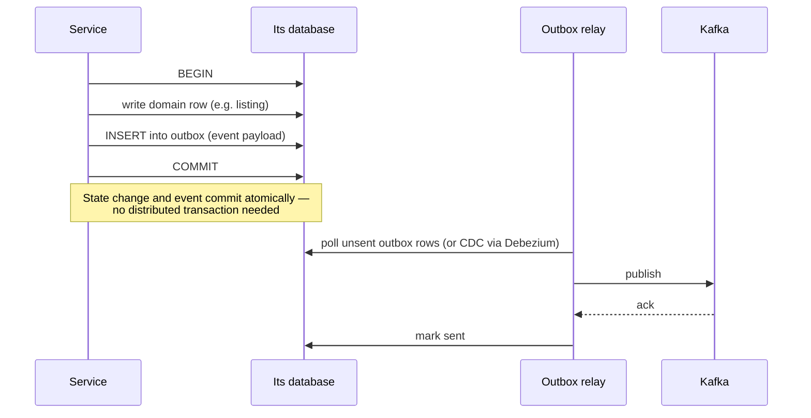
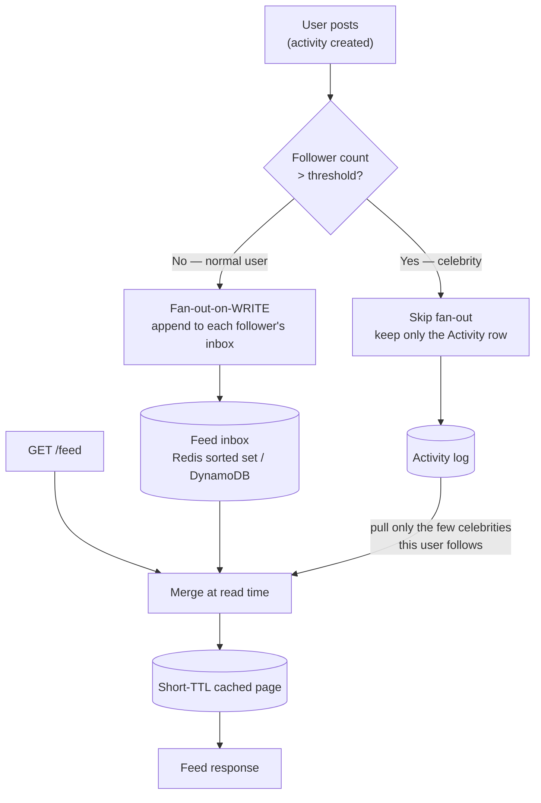
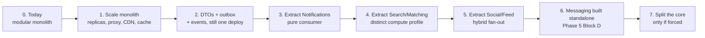

# Microservices — target architecture & migration plan

> **Status: PLANNING ONLY. Nothing here is built.**
> The system today is a **modular monolith** (see `CODEBASE.md`), deployed as described in
> `infra/README.md`. This document is the target picture and the ordered path to it, written
> so a future decision has context instead of guesswork.
>
> Audit in this doc reflects `main` @ `c515e17` (Phase 5 Blocks A–C shipped).

---

## TL;DR — the recommendation

**Do not big-bang this.** "More users" and "microservices" are different problems:
microservices solve **team/ownership scaling** and **independent scaling of hot components**.
Raw traffic is solved far more cheaply by scaling the monolith horizontally — and this
monolith is already stateless, so most of that is config, not code.

The recommended order:

1. **Scale the monolith** (replicas, RDS Proxy, read replica, CDN, feed→Redis) — §3
2. **Add the event backbone + transactional outbox** *inside* the monolith — §5
3. **Extract three services only**: Notifications → Search/Matching → Social/Feed — §8
4. **Build Messaging (Phase 5 Block D) standalone from day one** — it is stateful, so it
   never belongs in the monolith
5. **Leave Identity + Profiles + Marketplace + Reviews as the core** until team size or a
   measured bottleneck forces them apart

Extracting Identity first is the classic trap: everything depends on it, so you get all the
distributed-systems cost and none of the benefit.

---

## 1. Where we are today

One Django image runs as two ECS services (web + Celery worker), against **one** Postgres.
All eight `apps/` share that database, and every cross-app call is an in-process Python
function call inside a single ACID transaction.

### 1.1 The boundary audit (measured, not assumed)

Runtime cross-app coupling was **exactly five seams** at audit time; seam #3 has since been
eliminated (Stage 0), leaving four.

| # | Caller → Callee | Call | Kind | Becomes |
|---|---|---|---|---|
| 1 | `bands`, `connections`, `engagements`, `listings`, `musicians`, `reviews`, `social`, `venues` → `users` | `get_user_by_username()` | **Query** | RPC to Identity (+ local cache) |
| 2 | `reviews` → `engagements` | `parties_of_completed_engagement()` | **Query** | RPC to Marketplace (review gate) |
| ~~3~~ | ~~`musicians` → `reviews`~~ | ~~`rating_summary()` on every profile GET~~ | ✅ **ELIMINATED** | Denormalized to `MusicianProfile.rating_avg/​rating_count`, pushed by `reviews` post-commit. Direction reversed: `musicians` now has **zero** dependency on `reviews`. |
| 4 | `listings` → `social` | `record_activity()` | **Event** | publish `listing.posted` |
| 5 | `bands` → `social` | `record_activity()` | **Event** | publish `band.created` |

Notes from the audit:

- **Service layers never import another app's models at runtime.** Every
  `from apps.users.models import User` in a `services.py` is under a `TYPE_CHECKING` guard.
  Views import `User` at runtime only for `cast(User, request.user)`, which is the
  auth-provided object — not a boundary crossing.
- `apps/social/management/commands/seed_demo_phase5.py` imports five other apps' services.
  That is **tooling**, not runtime coupling — it deliberately drives real pipelines. It will
  become a script that calls public APIs, or gets split per service.
- Seam #3 was the one genuinely wrong shape: a **synchronous cross-context read on a hot
  read path** — cheap in-process, expensive over a network. **Now fixed** (§6 item 2).

### 1.2 What the service rule did *not* buy us

Talking through services solved **code** coupling. Two kinds of **data** coupling remain:

- **24 DB-enforced FKs to `AUTH_USER_MODEL`** across 8 apps
  (`social` 5, `bands`/`listings`/`engagements`/`connections`/`reviews` 3 each,
  `musicians`/`venues` 2 each). A foreign key cannot span two databases.
- **Service functions return ORM objects.** `get_user_by_username()` hands back a `User`
  and callers read `.email` / `.pk`. You cannot return an ORM instance over a wire.

The already-correct pattern is visible in Phase 5: `Activity.target_id` and
`Review.context_id` are **plain `UUIDField`s with no FK** — deliberately denormalized
cross-context references. That is the target shape for every seam.

---

## 2. Target architecture

**Synchronous request path** (queries — see §4):

**Asynchronous event backbone** (events — see §4 and §5). Every arrow here is
fire-and-forget; no service blocks on another:

| Service | Owns | Scaling profile | Sync API (queries in) | Events out |
|---|---|---|---|---|
| **Identity** | users, auth, contact info | foundational, read-heavy | `getUser`, `getUserByUsername` | `user.created`, `user.renamed` |
| **Profiles** | profiles, instruments, genres | read-heavy, cacheable | `getProfile` | `profile.updated` |
| **Search / Matching** | embeddings, blurbs | compute/IO-heavy, spiky | `search`, `compatibility` | — |
| **Marketplace** | listings, bands, engagements, venues | transactional | `getEngagementParties` | `listing.posted`, `band.created`, `engagement.completed` |
| **Social / Feed** | follow graph, activity log, feed inbox | **write-amplified, hottest reads** | `getFeed`, `getFollowers` | `follow.created`, `follow.removed` |
| **Reviews** | reviews, rating aggregates | moderate | `getRatingSummary` | `review.created` |
| **Notifications** | — (pure consumer) | bursty | — | — |
| **Messaging** (Block D) | conversations, messages | **stateful WebSockets** | WS connect/send | `message.sent` |

---

## 3. Scale the monolith first (do this before any split)

Highest value per hour of work, and none of it is wasted if you later split.

| Move | Why it matters | Effort |
|---|---|---|
| **Horizontal web replicas + autoscaling** | App is already stateless; raise ECS desired count, scale on CPU + p95 latency | config |
| **RDS Proxy / PgBouncer** | Django opens a connection per worker; Postgres dies on connection count long before CPU. **Non-negotiable past a few replicas.** | infra |
| **RDS read replica + read routing** | Public profiles, browse, search, feed reads are read-heavy | infra + DB router |
| **CloudFront in front of public GETs** | Public profiles / follower lists / reviews are cacheable and currently hit Django every time | infra |
| **Redis read-through cache** for hot objects | Profile payloads, rating summaries | small code |
| **Move the feed inbox off Postgres** | `FeedEntry` is write-amplified *and* read-hot — the first table to hurt | medium code |

This alone carries the product a very long way on essentially today's architecture.

---

## 4. Two communication patterns — and only two

Every cross-service interaction is either a **Query** or an **Event**. Classify before you cut.

- **Query** — synchronous, "I need an answer to serve this request." → RPC (gRPC or HTTP),
  with a timeout, a retry budget, a circuit breaker, and a **defined degradation**.
- **Event** — "this happened, whoever cares can react." → published to Kafka, consumed
  asynchronously. Never blocks the producer.

**The tell for a hidden event:** a call that is synchronous today but internally does
`transaction.on_commit(... .delay())`. `record_activity()` is exactly this — `listings` and
`bands` call it synchronously, and it immediately turns into a background task. It is
already an event; it just has not been named one. Convert those to real publishes
**before** extracting anything.

---

## 5. The transactional outbox (prerequisite) — ✅ IMPLEMENTED

Today services do `transaction.on_commit(lambda: task.delay(...))`. That is a good
lightweight pattern, but it has a real gap: if the process dies **after** the DB commit and
**before** the broker enqueue, the event is silently lost. On one node that is rare. Across
services it is unacceptable — it means permanent state divergence.

Consumers must be **idempotent** (dedupe on event id), because the relay guarantees
*at-least-once*, not exactly-once.

**Status: built and in use.** `apps/events` implements this — `OutboxEvent`,
`publish()`, a relay (`events.relay_outbox` nudge + `manage.py relay_outbox` sweep), and a
`topic -> task name` registry that dispatches without cross-app imports. **All 13 emitters
across 7 apps are migrated**; no service calls `.delay()` directly any more. Adopting it
inside the monolith surfaced a latent bug: `fan_out_activity` created a new `Activity` per
call, so at-least-once delivery would have duplicated a post in every follower's feed — it
now keys the `Activity` on the event id.

---

## 6. The coupling to break (concrete work items)

Ordered by leverage. All can be done inside the monolith, before any service exists.

1. **Return DTOs, not ORM objects.** Change boundary-crossing service functions
   (`get_user_by_username`, `parties_of_completed_engagement`, `rating_summary`) to return
   dataclasses/dicts. This forces the contract to be serializable and stops callers walking
   the ORM graph. **Highest-leverage single change in this document.**
2. ✅ **DONE — killed seam #3 (`musicians → reviews` on every profile read).**
   `MusicianProfile.rating_avg` / `rating_count` are written by `reviews` via a post-commit
   Celery task (`reviews.propagate_profile_rating` → `musicians.services.set_profile_rating`);
   the serializer is now a pure local read. Recomputed from source, so it is idempotent and
   self-healing, with `manage.py backfill_profile_ratings` as the reconciliation path.
   The task payload (`subject_user_id`) is already the shape of the future
   `review.rating.updated` event.
3. **`db_constraint=False` on FKs that cross a future boundary.** Turns DB-enforced FKs into
   logical UUID references — same column, no cross-DB constraint. Do it at the planned cut
   points, not everywhere.
4. ✅ **DONE — all 13 emitters publish to the outbox.** Producers publish domain events
   (`activity.recorded`, `review.created`, `follow.created`, …) and consumers subscribe via
   the registry; `record_activity` no longer reaches into `social`'s tasks.
5. **Simulate DB-per-service now**: separate Postgres *schemas* + Django DB routers. Any
   cross-schema join that breaks is a join that would have become a network call later —
   far cheaper to find today.

---

## 7. The feed is the hard part

Pure **fan-out-on-write** (what Phase 5 Block B ships) breaks on the celebrity problem: a
user with 500k followers posts once and you do 500k inbox writes. The standard fix is a
**hybrid**, and the existing model split already supports it — `Activity` is the canonical
log, `FeedEntry` is the materialized inbox.

- Normal users: pre-materialized inbox → feed read is a single range scan.
- Celebrities: no pre-write; their posts are pulled live at read time and merged.
- The merge is bounded because a user follows only a handful of celebrities.

Also required at volume: **partition** `activity` / `feed_entry` by time or user, **prune**
old inbox entries (a task already exists), and eventually **shard by `user_id`**.

---

## 8. Migration sequence

Strangler-fig. Each step ships independently and is reversible.

| Step | Why this one, at this point |
|---|---|
| **3. Notifications** | Pure event consumer, zero read dependencies, already Celery tasks. Trivial first cut whose real purpose is to build the Kafka + deploy + observability muscle on something that cannot break a user request. |
| **4. Search / Matching** | Genuinely different scaling profile (vector search, external API latency, spiky). Already isolated behind `openai_client.py` **with graceful degradation** — the resilience contract exists. |
| **5. Social / Feed** | The hot path and the one with write amplification. Already event-driven, so the seam is real. |
| **6. Messaging** | Stateful WebSockets — build it standalone rather than retrofit it out later. |
| **7. The core** | Identity / Profiles / Marketplace / Reviews stay together until a measured bottleneck or a second team forces the split. |

---

## 9. Deployment: today vs target

| Dimension | Today | High-traffic target |
|---|---|---|
| **Deploy unit** | 1 image, 2 ECS services | ~6–8 services, each its own image + pipeline |
| **Orchestration** | ECS Fargate, manual `terraform apply` | **EKS + HPA** (CPU, p95 latency, **Kafka consumer lag**), GitOps, canary/blue-green |
| **Data** | 1 RDS Postgres (pgvector) | **DB per service**; Aurora + read replicas; dedicated vector store; Redis clusters; DynamoDB/Cassandra feed inbox |
| **Async** | Celery + single Redis broker | **Kafka/MSK backbone**; Celery/Kafka consumers per service |
| **Inter-module comms** | in-process calls, one ACID txn | RPC for queries, events for propagation, **eventual consistency** |
| **Edge** | ALB → gunicorn | **CDN + WAF + gateway** → Ingress; optional service mesh (mTLS, retries, circuit breaking) |
| **Auth** | JWT verified in Django | Identity issues; verified at gateway **and** per service (JWT already stateless — this part is done) |
| **Connections** | direct to RDS | **RDS Proxy / PgBouncer** per service (mandatory) |
| **Consistency** | DB transactions | **outbox + sagas + idempotency keys** |
| **Observability** | JSON logs → CloudWatch | + **OpenTelemetry tracing**, Prometheus/Grafana, per-service SLOs |
| **Blast radius** | whole app | isolated per service (bulkheads) |
| **State** | stateless web + worker | stateless everywhere **except** the WebSocket connection layer |

---

## 10. Resilience — what changes when a call crosses a network

A function call cannot time out, return a 503, or partially succeed. A network call does all
three. Every RPC seam needs, explicitly:

- **Timeout + bounded retries with jittered backoff** (retries without jitter cause
  synchronized retry storms)
- **Circuit breaker** — stop hammering a service that is already down
- **A defined degradation.** This project already has the template: OpenAI failures degrade
  to `search → []`, `compatibility → 503`, `coach → null tip`, never a 500. **Copy that
  contract to every service call.** Decide up front: if Reviews is down, does a profile
  render with no rating, or fail? (Answer: render without it.)
- **Idempotency keys** on writes, so a retried request cannot double-apply
- **Bulkheads** — a slow dependency must not exhaust the caller's whole worker pool
- **Backpressure / rate limiting** at the edge

---

## 11. Traps

- **Do not distribute a transaction.** Anywhere one DB transaction spans two future services,
  you need a **saga** with compensating actions plus the outbox — never 2-phase commit.
- **Do not extract Identity first.** Everything depends on it.
- **Do not split on principle.** A service without a distinct scaling, ownership, or
  deploy-cadence need buys only latency and pager load. That is a distributed monolith:
  all of the cost, none of the benefit.
- **Version contracts from day one** — both event schemas and RPC APIs. Consumers outlive
  producers' assumptions.
- **Eventual consistency is a product decision, not just a technical one.** "Your review
  appears in their rating within a second or two" must be acceptable to the UX before you
  build it that way.

---

## 12. Open decisions

| Question | Options | Notes |
|---|---|---|
| Event backbone | MSK (Kafka) vs Kinesis vs SNS/SQS | Kafka matches the "event shape today = Kafka schema tomorrow" rule already in `CLAUDE.md`; SNS/SQS is cheaper and simpler to start |
| Orchestration | Stay on ECS vs move to EKS | ECS is fine for ~5 services; EKS earns its complexity at higher service count / richer autoscaling |
| RPC transport | gRPC vs HTTP+JSON | gRPC for typed contracts and speed; HTTP is simpler and debuggable |
| Feed store | Redis sorted sets vs DynamoDB | Redis is faster and simpler; DynamoDB is durable and cheaper at very large inbox volume |
| Vector store | keep pgvector vs dedicated (Pinecone/Qdrant/OpenSearch) | pgvector + HNSW scales further than people assume — measure before moving |
| Celebrity threshold | follower count that flips to fan-out-on-read | Must be measured, not guessed |

---

## Related docs

- `CLAUDE.md` — the four scale rules this design assumes, plus all conventions and gotchas
- `CODEBASE.md` — current app layout and the endpoint surface
- `DATAMODEL.md` — models, including the already-denormalized cross-context refs
- `ROADMAP.md` — phase status; Phase 5 Block D (messaging) is deferred
- `infra/README.md` — the current AWS stack and deploy runbook
